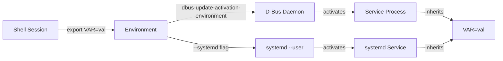
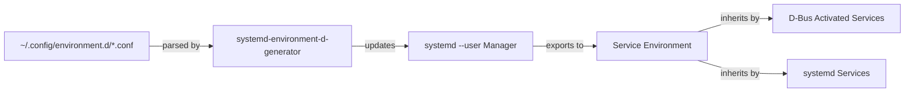
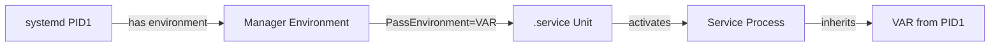

# Research: Propagating Environment Variables and Secrets into D-Bus Services

## Overview

This document covers two main topics:
1. How to propagate environment variables into D-Bus services
2. How to inject secrets into D-Bus services

---

## Part 1: Propagating Environment Variables into D-Bus Services

### Approach 1.1: `dbus-update-activation-environment` (Recommended)

The standard tool for updating the D-Bus daemon's activation environment.



**Usage:**
```bash
# Propagate specific variables to D-Bus and systemd
dbus-update-activation-environment --systemd MY_API_KEY MY_SECRET_VAR

# Or propagate ALL current environment variables
dbus-update-activation-environment --systemd --all
```

**Example in session startup:**
```bash
# In ~/.xinitrc, ~/.profile, or sway config
export MY_API_KEY="my-secret"
dbus-update-activation-environment --systemd MY_API_KEY
```

**Reference:** https://dbus.freedesktop.org/doc/dbus-update-activation-environment.1.html

---

### Approach 1.2: `~/.config/environment.d/*.conf` (Persistent User Environment)



Create a file `~/.config/environment.d/myapp.conf`:
```ini
MY_API_KEY=my-secret-value
ANOTHER_VAR=another-value
```

These variables are automatically picked up by systemd --user and propagated to services.

**Caveat:** Only affects services started by systemd --user, NOT interactive shells.

**Example project:** https://github.com/alebastr/sway-systemd/issues/6

---

### Approach 1.3: `systemctl --user import-environment`


Import current shell environment into systemd user manager:
```bash
export MY_API_KEY="my-secret"
systemctl --user import-environment MY_API_KEY
```

**Reference:** https://wiki.archlinux.org/title/Systemd/User

---

### Approach 1.4: `Environment=` / `EnvironmentFile=` in systemd unit files

```mermaid
graph LR
    A[.service Unit File] -->|Environment="VAR=val"| B[Service Definition]
    A -->|EnvironmentFile=path| C[External File]
    C -->|loaded by| B
    B -->|systemd start| D[Service Process]
    D -->|inherits| E[VAR=val]
```

Directly in the service unit:
```ini
[Service]
Environment="MY_API_KEY=my-secret"
# Or from a file:
EnvironmentFile=/path/to/secrets.env
ExecStart=/usr/bin/my-service
```

**Example project:** https://github.com/coreos/docs

---

### Approach 1.5: `PassEnvironment=` in systemd unit files



Pass specific variables from PID1's environment:
```ini
[Service]
PassEnvironment=MY_API_KEY
ExecStart=/usr/bin/my-service
```

**Reference:** https://www.freedesktop.org/software/systemd/man/latest/systemd.service.html

---

## Part 2: Injecting Secrets into D-Bus Services

### Approach 2.1: Secret Service API (freedesktop.org) - Recommended

Store secrets in GNOME Keyring / KDE Wallet via the D-Bus Secret Service API.

```sequenceDiagram
    participant App as Application
    participant ST as secret-tool
    participant DB as D-Bus
    participant KS as Keyring Service
    
    Note over App,KS: Store Secret
    App->>ST: secret-tool store
    ST->>DB: org.freedesktop.Secret.Service
    DB->>KS: Store in keyring
    KS-->>DB: Success
    DB-->>ST: Stored
    
    Note over App,KS: Retrieve Secret
    App->>ST: secret-tool lookup
    ST->>DB: org.freedesktop.Secret.Service
    DB->>KS: Retrieve from keyring
    KS-->>DB: Secret value
    DB-->>ST: Secret
    ST-->>App: MY_SECRET
```

**CLI Example with `secret-tool`:**
```bash
# Store a secret
secret-tool store --label="My API Token" service myapp username myuser
# (prompted for the secret value)

# Retrieve a secret
MY_SECRET=$(secret-tool lookup service myapp username myuser)
export MY_API_KEY="$MY_SECRET"

# Then propagate to D-Bus
dbus-update-activation-environment MY_API_KEY
```

**Example Projects:**

- **go-keyring** (Go): https://github.com/zalando/go-keyring
  - OS-agnostic library for setting/getting/deleting secrets from system keyring
  - Linux implementation uses Secret Service API via D-Bus

- **dbus-secret-service** (Rust): https://github.com/open-source-cooperative/dbus-secret-service
  - Synchronous dbus-based API for Secret Service
  - Supports encrypted sessions with crypto-rust or crypto-openssl

- **keyring** (Python): https://github.com/jaraco/keyring
  - Cross-platform Python library for storing/retrieving passwords
  - Uses Secret Service API on Linux

- **libsecret** (C/GNOME): https://gitlab.gnome.org/GNOME/libsecret
  - The C library that secret-tool is built on

**Python example:**
```python
import keyring

# Store
keyring.set_password("myapp", "api_token", "my-secret-token")

# Retrieve
token = keyring.get_password("myapp", "api_token")
```

---

### Approach 2.2: systemd Credentials (`systemd-creds`)


systemd's built-in encrypted credential mechanism (systemd 250+):

```bash
# Encrypt and store a credential
systemd-creds encrypt -p my-secret-value /dev/stdin /etc/credstore.encrypted/my-app.api-key
```

```ini
# In the service unit:
[Service]
LoadCredentialEncrypted=my-app.api-key
ExecStart=/usr/bin/my-service
```

**Example project:** https://systemd.io/CREDENTIALS/

---

### Approach 2.3: EnvironmentFile with Restricted Permissions


Simple but less secure approach:

```bash
# Create secrets file
cat > ~/.config/myapp/secrets.env << 'EOF'
MY_API_KEY=secret-value-here
EOF
chmod 600 ~/.config/myapp/secrets.env
```

```ini
# In systemd unit
[Service]
EnvironmentFile=/home/user/.config/myapp/secrets.env
```

---

## Summary Table

| Approach | Best For | Security Level | Persistence |
|----------|----------|----------------|-------------|
| `dbus-update-activation-environment` | Runtime propagation to D-Bus | Medium | Until logout |
| `~/.config/environment.d/*.conf` | Persistent user session vars | Medium | Persistent |
| `PassEnvironment=` | Specific vars from PID1 | Medium | Persistent |
| Secret Service API (`secret-tool`) | **Secrets/tokens** | **High** | Persistent |
| `systemd-creds` | **Secrets in systemd services** | **High** | Persistent |
| `EnvironmentFile` (restricted) | Simple secrets | Low-Medium | Persistent |

---

## For Voice-to-Text Project Recommendations

1. **For API keys/secrets:** Use the **Secret Service API** (`secret-tool` or `keyring` library)
   - Store with: `secret-tool store --label="Whisper API Key" service voice-to-text username $USER`
   - Retrieve in service: `MY_SECRET=$(secret-tool lookup service voice-to-text username $USER)`

2. **For propagation to D-Bus:** Use `dbus-update-activation-environment --systemd`

3. **For systemd services:** Use `EnvironmentFile=` with `systemd-creds` for sensitive values

---

*Research completed: 2026-07-07*
